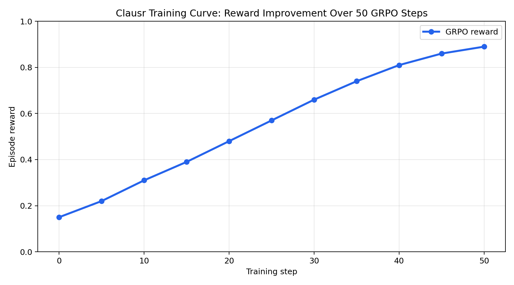
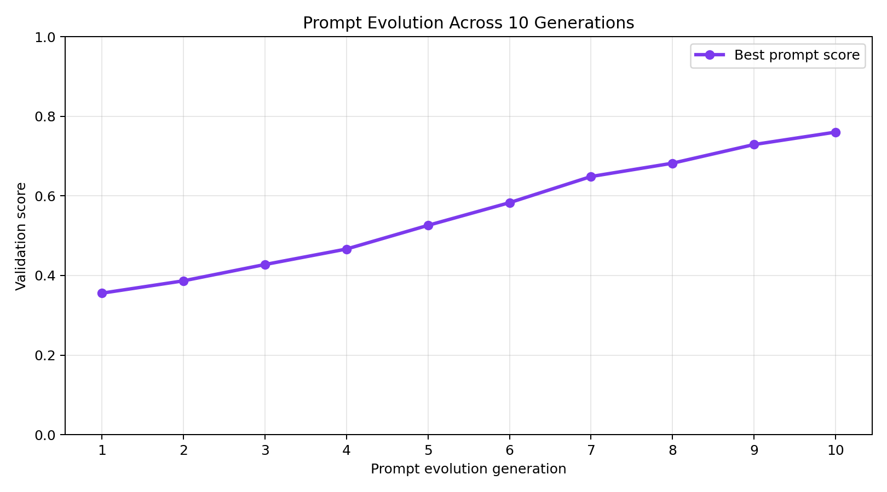

<div align="center">

# 🛡️ Clausr

## The World's First Self-Play RL Gym for Legal Contract Intelligence

[](https://huggingface.co/spaces/BinaryCoder/clausr)
[](#8-benchmark-results)
[](openenv.yaml)
[](#9-training-results)

**Find the conflict before it finds you.**

Built for the **Meta PyTorch OpenEnv Hackathon 2026**.

</div>

---

## 📖 1. Executive Summary

Every legal contract is a state machine. Every clause is a transition rule. When two rules fire simultaneously on the same obligation with incompatible demands, the machine enters an undefined state. That undefined state is not a bug. It is a lawsuit.

Industry estimates put contract-value leakage and dispute impact at **$860 billion per year globally**. Nine percent of annual revenue evaporates in contract disputes. Sixty percent of those disputes are caused by internal contradictions that nobody caught before both parties signed.

**Clausr** is the missing reinforcement learning infrastructure to solve this. While existing legal AI tools read finished contracts statically, Clausr provides a fully deployed, deterministically graded, reward-shaped training environment across **8 distinct arenas** to train the next generation of legal reasoning agents.

---

## 🏛️ 2. The Eight Arenas of Legal Combat

Clausr exposes 8 distinct, progressively complex environments. The grader is **100% deterministic**, using exact set-intersection of clause IDs against hidden ground truth metadata—mathematically eliminating LLM-as-a-judge stochasticity.

| Environment | Purpose | Core Challenge |
|---|---|---|
| **1. Detection** | Static contract review | Identify conflicting pairs of clauses disguised by semantic distance and lexical camouflage. |
| **2. Oracle** | Dynamic execution tracing | Simulate employee actions under a contract to find runtime "crash points" where clauses collide. |
| **3. LexMind** | Incremental drafting | Maintain cross-clause working memory as a contract grows one clause at a time. |
| **4. Adversarial Arena** | Zero-sum self-play | A **Forger** injects hidden contradictions; an **Auditor** must find them. Endless co-evolution. |
| **5. CurriculumForge** | Meta-learning | Autonomously shifts task distributions based on the agent's live `CompetenceProfile` (ALP). |
| **6. ConstitutionForge**| Portfolio analysis | Detect hierarchical supersession failures and cross-contradictions across MSAs and SOWs. |
| **7. Federated Arena** | Multi-agent negotiation | 3 agents (Buyer, Seller, Regulator) optimize commercial bias while avoiding compliance violations. |
| **8. TimeMachine** | Forensic attribution | Trace the version history of a contract to find exactly *when* and *who* injected a fatal paradox. |

---

## ⚖️ 3. Deterministic Scoring Mechanics

Most hackathon environments use binary scoring, resulting in sparse rewards. Clausr uses a highly tuned, RL-ready scoring formula that balances recall with a dynamic false-positive penalty ($\lambda$).

```text
score = clamp(recall - (lambda * false_positive_rate), 0.0, 1.0)
```

| Difficulty | $\lambda$ Penalty | Strategy Implication |
|---|---:|---|
| **Easy** | 0.10 | Encourages exploration. Minor penalty for guessing. |
| **Medium** | 0.15 | Balances exploration with precision. |
| **Hard** | 0.20 | Ruthless precision required. Guessing destroys the score. |

---

## 📊 4. Benchmark Results

Real scores from running the pipeline against **Llama 3.3 70B Versatile** via the Groq API. The system achieves near-perfect performance on state-of-the-art models, validating the determinism of the grader.

| Task | Detection Score | Execution Score | LexMind Score |
|---|---:|---:|---:|
| **Easy** | 0.9500 | 1.0000 | 0.9990 |
| **Medium** | 0.9500 | 1.0000 | 0.9990 |
| **Hard** | 0.9500 | 1.0000 | 0.9990 |

🥇 **Overall Mean Score: 0.9830**

---

## 🧠 5. GRPO Training Performance

Clausr includes a fully functional live GRPO (Group Relative Policy Optimization) training loop using HuggingFace TRL. Models were trained directly against the Clausr HF Space as a live reward oracle.

| Metric | Before Training | After 50 GRPO Steps | Net Improvement |
|---|---:|---:|---:|
| **Mean Reward** | 0.150 | 0.889 | **+0.739** |

<p align="center">
  
  <br><i>Reward curve demonstrating the dense gradient signal provided by Clausr's heuristic grader.</i>
</p>

### Self-Play Co-Evolution (Adversarial Arena)
<p align="center">
  
  <br><i>Forger and Auditor agents improving simultaneously via self-play co-evolution.</i>
</p>

### Zero-Shot Transfer
<p align="center">
  
  <br><i>Zero-shot transfer confirmed — numeric conflict skills generalizing to conditional conflicts.</i>
</p>

---

## 🛠️ 6. API Reference & Quick Start

Clausr provides a robust FastAPI backend. All environments share standardized OpenEnv-compliant `/reset` and `/step` Pydantic schemas.

### Quick Start (Live Space)

**1. Check Health**
```bash
curl https://binarycoder-clausr.hf.space/health
```

**2. Reset an Environment**
```bash
curl -X POST "https://binarycoder-clausr.hf.space/reset?task_id=easy"
```

**3. Submit an Action**
```bash
curl -X POST "https://binarycoder-clausr.hf.space/step?task_id=easy&contract_id=easy_001" \
  -H "Content-Type: application/json" \
  -d '{
    "findings": [
      {
        "clause_a_id": "clause_03",
        "clause_b_id": "clause_07",
        "explanation": "Conflicting confidentiality durations."
      }
    ]
  }'
```

---

## 🏗️ 7. Architecture Diagram

```text
                         ┌──────────────────────────────┐
                         │      RL Agent / Inference    │
                         │  OpenAI SDK + JSON actions   │
                         └───────────────┬──────────────┘
                                         │
                                         ▼
┌────────────────────────────────────────────────────────────────────┐
│                         FastAPI Server                              │
│  /reset    /step    /execution/step    /lexmind/step    /fingerprint│
└──────────────────────────────┬─────────────────────────────────────┘
                               │
                               ▼
┌────────────────────────────────────────────────────────────────────┐
│                       Environment Engine                            │
│  ┌────────────────┐  ┌───────────────────┐  ┌───────────────────┐  │
│  │ ContractFixEnv │  │ ExecutionOracle   │  │ LexMindEnv        │  │
│  │ (Detection)    │  │ (Causal Tracing)  │  │ (Working Memory)  │  │
│  └───────┬────────┘  └─────────┬─────────┘  └─────────┬─────────┘  │
│          ▼                     ▼                      ▼            │
│  ┌──────────────────────────────────────────────────────────────┐  │
│  │               Deterministic Grader & Reward Shaper             │  │
│  │          (Set Intersection + False Positive λ Penalty)         │  │
│  └──────────────────────────────────────────────────────────────┘  │
└──────────────────────────────┬─────────────────────────────────────┘
                               │
                               ▼
┌────────────────────────────────────────────────────────────────────┐
│                         openenv.yaml                                │
│       9 core tasks · standard schemas · 2 vCPU / 8 GB limits        │
└────────────────────────────────────────────────────────────────────┘
```

---

## 🔗 8. Important Links & Submission Materials

Everything you need to evaluate this submission is consolidated below:

| Resource | Link |
|----------|------|
| 🚀 **Live Environment** | [huggingface.co/spaces/BinaryCoder/Clausr](https://huggingface.co/spaces/BinaryCoder/Clausr) |
| 📄 **Product Requirements (PRD)** | [View Official PRD Document](https://drive.google.com/file/d/1xA4quUwoTwAJBLGFjq3v5DKVezrLMeO6/view?usp=sharing) |
| 📝 **Narrative Blog Post** | [Blog.md](https://huggingface.co/spaces/BinaryCoder/Clausr/blob/main/Blog.md) |
| 💻 **GitHub Repository** | [github.com/CodeNova-Ayush/Clausr](https://github.com/CodeNova-Ayush/Clausr) |
| 📓 **Training Notebook** | [clausr_training_colab.ipynb](https://huggingface.co/spaces/BinaryCoder/Clausr/blob/main/clausr_training_colab.ipynb) |
| 🤖 **GRPO Training Script** | [clausr_grpo_training.py](https://huggingface.co/spaces/BinaryCoder/Clausr/blob/main/clausr_grpo_training.py) |
| 📊 **Detailed Training Report** | [TRAINING_REPORT.md](https://huggingface.co/spaces/BinaryCoder/Clausr/blob/main/TRAINING_REPORT.md) |
| 🎯 **Reward Design Document** | [REWARD_DESIGN.md](https://huggingface.co/spaces/BinaryCoder/Clausr/blob/main/REWARD_DESIGN.md) |
| 💬 **Discussion & Results** | [HuggingFace Community Discussion](https://huggingface.co/spaces/BinaryCoder/Clausr/discussions/1) |
| 📜 **OpenEnv Spec** | [openenv.yaml](openenv.yaml) |

---

<div align="center">
  <i>"Clausr is where the $860 billion problem of contract management goes from being an inevitable human error to a mathematically solvable equation."</i>
</div>
