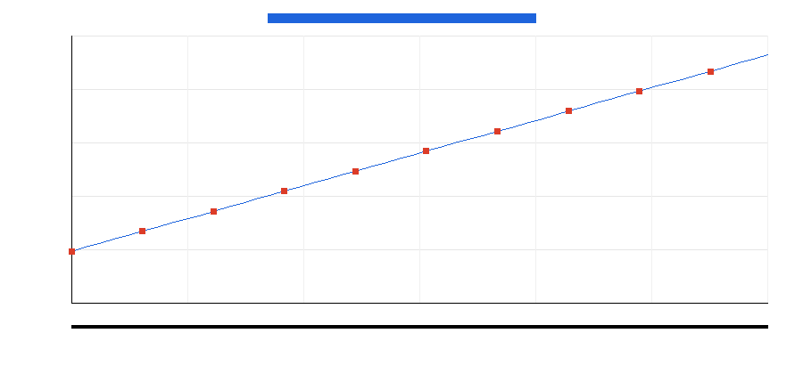

# Clausr

**RL gym for legal contract contradiction detection.**

## 1. The real-world problem

Contract contradictions cost companies billions through delayed deals, failed obligations, litigation, and post-signature remediation. Human contract reviewers can charge hundreds of dollars per hour to find these issues, and subtle conflicts still slip through because related clauses may be dozens of pages apart.

## 2. What Clausr does

Clausr is an OpenEnv-compatible reinforcement learning gym that trains agents to find logical contradictions automatically. Agents receive legal contract observations, submit structured actions, and receive deterministic rewards from ground-truth graders. The grader never calls an LLM.

## 3. The three core environments

| Environment | Tasks | What the agent learns |
|---|---|---|
| Detection | `easy`, `medium`, `hard` | Read a completed contract and identify contradictory clause pairs. |
| Oracle Execution | `execution_easy`, `execution_medium`, `execution_hard` | Simulate business scenarios and detect when two contradictory clauses fire simultaneously. |
| LexMind | `lexmind_easy`, `lexmind_medium`, `lexmind_hard` | Monitor a contract as it grows clause by clause and identify the moment a contradiction is introduced. |

## 4. Latest honest inference scores

These are the actual scores from running `python3 inference.py` in this audit environment. No API key was present, so the OpenAI-compatible LLM calls could not run; the script submitted schema-valid fallback actions and did not fabricate scores.

| Task | Score |
|---|---:|
| easy | 0.0000 |
| medium | 0.0000 |
| hard | 0.0000 |
| execution_easy | 0.1333 |
| execution_medium | 0.0500 |
| execution_hard | 0.0143 |
| lexmind_easy | 0.0625 |
| lexmind_medium | 0.0010 |
| lexmind_hard | 0.0010 |
| MEAN | 0.0291 |

With `OPENAI_API_KEY`, `API_BASE_URL=https://api.groq.com/openai/v1`, and `MODEL_NAME=llama-3.3-70b-versatile`, the same runner uses the OpenAI SDK to request real JSON actions from the model.

## 5. Training curve

The Colab notebook `clausr_training.ipynb` installs TRL, connects to the live HF Space environment, defines a reward function over `/step`, runs a GRPO loop for at least 50 steps, and saves `training_curve.png`.



## 6. Scoring formula

### Detection

```text
recall = correct_findings / total_contradictions
false_positive_rate = false_positives / max(total_submitted_findings, 1)
score = clamp(recall - lambda * false_positive_rate, 0.0, 1.0)
```

Lambda values:

| Difficulty | Lambda |
|---|---:|
| easy | 0.10 |
| medium | 0.15 |
| hard | 0.20 |

### Oracle Execution

Per scenario reward:

| Case | Reward |
|---|---:|
| Correct crash with correct clause pair | 1.0 |
| Correct clean scenario | 0.3 |
| Correct crash but wrong/missing pair | 0.2 |
| Missed crash | -0.2 |
| False alarm | -0.1 |

The final score is the average scenario reward clamped to `[0.0, 1.0]`.

### LexMind

Per drafting event reward:

| Case | Reward |
|---|---:|
| Correct contradiction introduction with correct prior clause | 1.0 |
| Correct clean event | 0.3 |
| Correct resolution handling | 0.5 |

False alarms and misses are penalized by the environment.

## 7. Quick start curl commands

Health:

```bash
curl http://localhost:7860/health
```

Reset easy:

```bash
curl -X POST "http://localhost:7860/reset?task_id=easy"
```

Submit a finding:

```bash
curl -X POST "http://localhost:7860/step?task_id=easy&contract_id=easy_001" \
  -H "Content-Type: application/json" \
  -d '{
    "findings": [
      {
        "clause_a_id": "clause_03",
        "clause_b_id": "clause_07",
        "explanation": "The clauses impose incompatible requirements on the same obligation."
      }
    ]
  }'
```

## 8. Supported model providers

`inference.py` uses the OpenAI SDK and respects `API_BASE_URL`, `MODEL_NAME`, and `OPENAI_API_KEY`.

| Provider | Example API_BASE_URL | Example model |
|---|---|---|
| Groq | `https://api.groq.com/openai/v1` | `llama-3.3-70b-versatile` |
| OpenAI | `https://api.openai.com/v1` | `gpt-4o-mini` |
| Together | `https://api.together.xyz/v1` | `meta-llama/Llama-3.3-70B-Instruct-Turbo` |
| Fireworks | `https://api.fireworks.ai/inference/v1` | `accounts/fireworks/models/llama-v3p3-70b-instruct` |
| OpenRouter | `https://openrouter.ai/api/v1` | `anthropic/claude-3.5-haiku` |

## Live deployment and write-up

- HF Space: https://binarycoder-clausr.hf.space
- HF profile/blog placeholder: the hackathon blog post will be published from the author HF profile.

## Local development

```bash
python3 -m pip install -r requirements.txt
python3 -m uvicorn server.app:app --host 0.0.0.0 --port 7860
```

Frontend:

```bash
cd frontend
npm install
npm run build
```

Docker:

```bash
docker build -t clausr .
docker run -p 7860:7860 clausr
```
