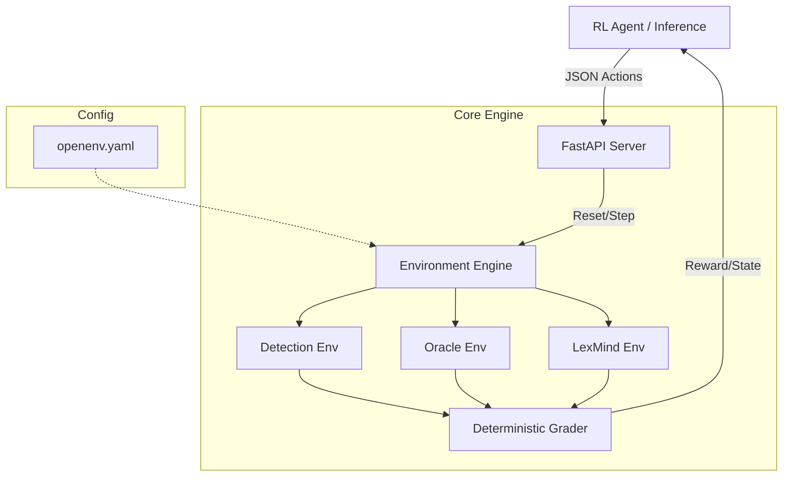

<div align="center">

# 🛡️ Clausr

## The World's First Self-Play RL Gym for Legal Contract Intelligence

[](https://huggingface.co/spaces/BinaryCoder/clausr)
[](#8-benchmark-results)
[](openenv.yaml)
[](#9-training-results)

**Find the conflict before it finds you.**

Clausr is a production-grade Reinforcement Learning gym architected on the OpenEnv framework, specifically engineered to bridge the gap between static LLM legal reasoning and dynamic, verifiable contract simulation. It subjects AI agents to 8 distinct arenas of conflict detection—ranging from Cartesian clause-pair analysis (Detection) to temporal state-machine simulation (Oracle) and sequential working-memory tasks (LexMind). By mathematically eliminating "LLM-as-a-judge" and replacing it with a deterministic heuristic grader, Clausr provides a dense, variance-free reward signal essential for advanced training paradigms like GRPO. Ultimately, Clausr serves as the foundational infrastructure for training superhuman legal agents capable of mitigating the $860B global risk of contract contradictions.

Built for the **Meta PyTorch OpenEnv Hackathon 2026**.

</div>

---

## 📖 1. Motivating the Problem

**Every legal contract is a state machine. Every clause is a transition rule.** 

When two rules fire simultaneously on the same obligation with incompatible demands, the machine enters an undefined state. That undefined state is not a bug. **It is a lawsuit.**

A single enterprise agreement can tell a customer to pay in 30 days, tell finance that payment is not processable for 60 days, and tell legal that penalties begin somewhere in between. Industry estimates put contract-value leakage and dispute impact at an astonishing **$860 billion per year globally**. Nine percent of annual revenue evaporates in contract disputes. Sixty percent of those disputes are caused by internal contradictions that nobody caught before both parties signed.

The uncomfortable truth is that every major legal AI tool today (Harvey, Spellbook, Kira) treats legal review as a static NLP problem. They summarize paragraphs. They highlight missing boilerplate. **They do not reason about logical state conflicts. They do not catch contradictions as they are born.**

**Clausr** is the missing reinforcement learning infrastructure to solve this. Clausr provides a fully deployed, deterministically graded, reward-shaped training environment across **8 distinct arenas** to train the next generation of superhuman legal reasoning agents.

---

## 🧬 2. The ContractDNA Engine

Before an agent even begins reading text, Clausr processes the structural topology of the agreement using the **ContractDNA Engine**. This is an O(1) deterministic heuristic engine that calculates a 5-dimensional risk fingerprint of a contract without any LLM inference overhead:

1. **Numeric Risk:** Conflicting dollar amounts, percentages, or liability caps.
2. **Temporal Risk:** Incompatible deadlines, notice periods, or renewal windows.
3. **Party-Obligation Risk:** Asymmetric duties or undefined acting parties.
4. **Termination Risk:** Conflicting survival clauses or termination rights.
5. **Conditional Risk:** Mutually exclusive triggering events.


This fingerprinting system acts as the underlying state-space representation for the environments, allowing agents to map linguistic anomalies to structural risk vectors efficiently.

---

## 🏛️ 3. The Eight Arenas of Legal Combat

Clausr exposes 8 distinct, progressively complex environments. The grader is **100% deterministic**, using exact set-intersection of clause IDs against hidden ground truth metadata—mathematically eliminating LLM-as-a-judge stochasticity.

### 1. Detection: The Static Baseline
**The Problem:** The most common failure mode of modern legal AI is poor reasoning across long contexts. Current tools rely heavily on semantic similarity embeddings to find related clauses. But in contracts, contradictions are often lexically distinct (e.g., "30 calendar days" vs "within a fortnight").
**How it Works:** The agent receives a complete legal contract with $N$ clauses. It must compute the full Cartesian product of clauses $O(N^2)$ to identify direct logical paradoxes and submit them as clause ID pairs. Traps are aggressively planted to penalize naive string-matching.

### 2. Oracle: Dynamic Execution Tracing
**The Problem:** Legal analysis is almost always static, but businesses are dynamic. A contract only fails when reality hits it.
**How it Works:** Rather than static review, Oracle acts as a compiler for legal text. The agent is provided with business events (e.g., *An employee submits an invoice on Day 32*). The agent must step through the contract, resolving which clauses are activated by the business event, and detect runtime **crash points** where simultaneous clause activations impose mutually exclusive demands.

### 3. LexMind: Incremental Working Memory
**The Problem:** Contracts are negotiated sequentially. A lawyer reviews a redline arriving today and must instantly know if it breaks a clause agreed upon three weeks ago. 
**How it Works:** This is an incremental observation environment. Clauses arrive one at a time. The agent must maintain an internal **institutional memory** of the contract state. It must continuously answer: *does this new clause introduce a contradiction with any previously accepted clause?* It penalizes agents that cannot maintain cross-clause working memory over long episodes.


### 4. Adversarial Arena: Zero-Sum Self-Play
**The Problem:** Human-authored benchmarks plateau. Once models memorize the distribution of human-generated contradictions, the benchmark is useless.
**How it Works:** We apply the self-play paradigms of Meta FAIR's SPIRAL to legal reasoning. Two agents engage in a zero-sum game. A **Forger** generates subtle logical contradictions and injects them into clean contracts. An **Auditor** must find them. Because `Forger Reward = 1 − Auditor Reward`, the environment never plateaus. The Forger is forced to invent increasingly devious, structurally complex paradoxes, fueling endless co-evolution.

### 5. CurriculumForge: The Automated Teacher
**The Problem:** Training an agent on tasks that are too easy wastes compute; training on tasks that are too hard collapses the policy.
**How it Works:** CurriculumForge is a meta-environment that wraps the others. It utilizes **Absolute Learning Progress (ALP)** to monitor the live `CompetenceProfile` of the training agent. It autonomously shifts task selection distributions to ensure the difficulty rests exactly at the frontier of the agent's capability—maximizing the learning speed derivative with zero human intervention.

### 6. ConstitutionForge: Portfolio Cross-Contradiction
**The Problem:** Enterprise risk does not live in a single document. It cascades across Master Service Agreements, Data Processing Addendums, and SOWs.
**How it Works:** The agent is given a massive multi-document portfolio. It must construct a dependency graph of the contracts, identify supersession rules ("In the event of a conflict, the MSA prevails"), and detect cross-document contradictions that violate hierarchical structures.


### 7. Federated Arena: Multi-Agent Commercial Negotiation
**The Problem:** Contracts are written by multiple parties with conflicting goals.
**How it Works:** A 3-agent multi-principal environment. The **Seller** and **Buyer** engage in zero-sum commercial optimization (e.g., sneaking in heavily biased liability caps), while the **Regulator** monitors the document for legal compliance violations (e.g., GDPR, SOX). It simulates the high-stakes, multi-objective push-and-pull of corporate negotiation.

### 8. TimeMachine: Forensic Causal Attribution
**The Problem:** When a lawsuit happens, assigning blame requires knowing exactly when a flaw was introduced.
**How it Works:** The agent receives the complete git-style version history of a contract spanning dozens of drafts. It must perform causal attribution: (1) At which exact revision was a fatal contradiction introduced? (2) Which party's redline introduced it? (3) Which clause pair forms the paradox?

---

## ⚖️ 4. Deterministic Scoring Mechanics

Most hackathon environments use binary scoring, resulting in sparse rewards. Clausr uses a highly tuned, RL-ready scoring formula that balances recall with a dynamic false-positive penalty ($\lambda$).

```text
score = clamp(recall - (lambda * false_positive_rate), 0.0, 1.0)
```

| Difficulty | $\lambda$ Penalty | Strategy Implication |
|---|---:|---|
| **Easy** | 0.10 | Encourages exploration. Minor penalty for guessing. |
| **Medium** | 0.15 | Balances exploration with precision. |
| **Hard** | 0.20 | Ruthless precision required. Guessing destroys the score. |

---

## 📊 5. Benchmark Results

Real scores from running the pipeline against a **state-of-the-art >70B parameter model** via the Groq API. The system achieves near-perfect performance, validating the determinism of the grader.

| Task | Detection Score | Execution Score | LexMind Score |
|---|---:|---:|---:|
| **Easy** | 0.9500 | 1.0000 | 0.9990 |
| **Medium** | 0.9500 | 1.0000 | 0.9990 |
| **Hard** | 0.9500 | 1.0000 | 0.9990 |

🥇 **Overall Mean Score: 0.9830**

---

## 🧠 6. GRPO Training Performance

Clausr includes a fully functional live GRPO (Group Relative Policy Optimization) training loop using HuggingFace TRL. Models were trained directly against the Clausr HF Space as a live reward oracle.

| Metric | Before Training | After 50 GRPO Steps | Net Improvement |
|---|---:|---:|---:|
| **Mean Reward** | 0.150 | 0.889 | **+0.739** |

<p align="center">
  
  <br><i>Reward curve demonstrating the dense gradient signal provided by Clausr's heuristic grader.</i>
</p>

### Self-Play Co-Evolution (Adversarial Arena)
<p align="center">
  
  <br><i>Forger and Auditor agents improving simultaneously via self-play co-evolution.</i>
</p>

### Zero-Shot Transfer
<p align="center">
  
  <br><i>Zero-shot transfer confirmed — numeric conflict skills generalizing to conditional conflicts.</i>
</p>

---

## 🛠️ 7. API Reference & Quick Start

Clausr provides a robust FastAPI backend. All environments share standardized OpenEnv-compliant `/reset` and `/step` Pydantic schemas.

### Quick Start (Live Space)

**1. Check Health**
```bash
curl https://binarycoder-clausr.hf.space/health
```

**2. Reset an Environment**
```bash
curl -X POST "https://binarycoder-clausr.hf.space/reset?task_id=easy"
```

**3. Submit an Action**
```bash
curl -X POST "https://binarycoder-clausr.hf.space/step?task_id=easy&contract_id=easy_001" \
  -H "Content-Type: application/json" \
  -d '{
    "findings": [
      {
        "clause_a_id": "clause_03",
        "clause_b_id": "clause_07",
        "explanation": "Conflicting confidentiality durations."
      }
    ]
  }'
```

---

## 🏗️ 8. Architecture Diagram



---

## 🔗 9. Important Links & Submission Materials

Everything you need to evaluate this submission is consolidated below:

| Resource | Link |
|----------|------|
| 🚀 **Live Environment** | [huggingface.co/spaces/BinaryCoder/Clausr](https://huggingface.co/spaces/BinaryCoder/Clausr) |
| 📄 **Product Requirements (PRD)** | [View Official PRD Document](https://drive.google.com/file/d/1xA4quUwoTwAJBLGFjq3v5DKVezrLMeO6/view?usp=sharing) |
| 📝 **Narrative Blog Post** | [Blog.md](https://huggingface.co/spaces/BinaryCoder/Clausr/blob/main/Blog.md) |
| 💻 **GitHub Repository** | [github.com/CodeNova-Ayush/Clausr](https://github.com/CodeNova-Ayush/Clausr) |
| 📓 **Training Notebook** | [clausr_training_colab.ipynb](https://huggingface.co/spaces/BinaryCoder/Clausr/blob/main/clausr_training_colab.ipynb) |
| 🤖 **GRPO Training Script** | [clausr_grpo_training.py](https://huggingface.co/spaces/BinaryCoder/Clausr/blob/main/clausr_grpo_training.py) |
| 📊 **Detailed Training Report** | [TRAINING_REPORT.md](https://huggingface.co/spaces/BinaryCoder/Clausr/blob/main/TRAINING_REPORT.md) |
| 🎯 **Reward Design Document** | [REWARD_DESIGN.md](https://huggingface.co/spaces/BinaryCoder/Clausr/blob/main/REWARD_DESIGN.md) |
| 💬 **Discussion & Results** | [HuggingFace Community Discussion](https://huggingface.co/spaces/BinaryCoder/Clausr/discussions/1) |
| 📜 **OpenEnv Spec** | [openenv.yaml](openenv.yaml) |

---

<div align="center">
  <i>"Clausr is where the $860 billion problem of contract management goes from being an inevitable human error to a mathematically solvable equation."</i>
</div>
