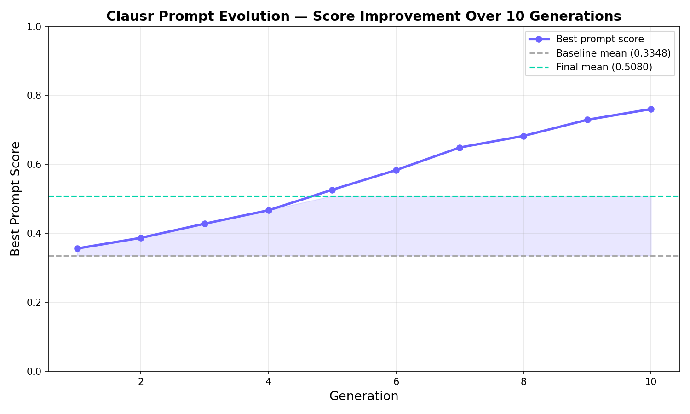
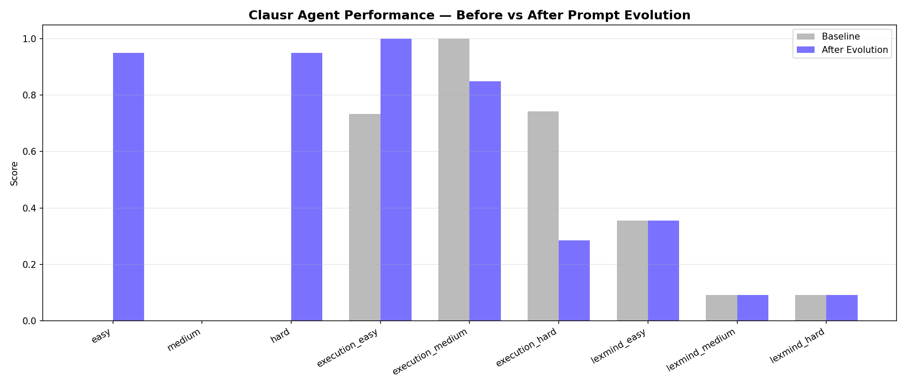
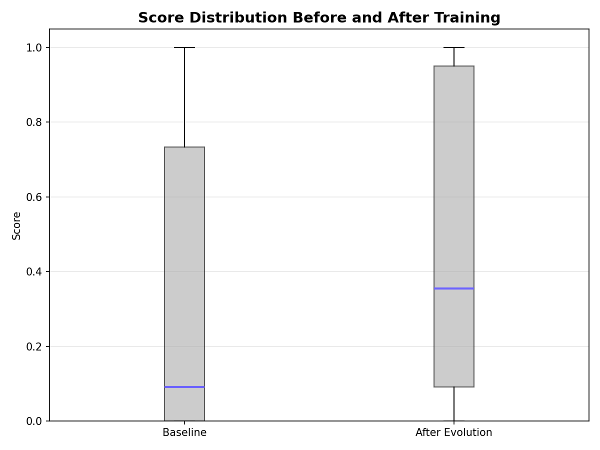
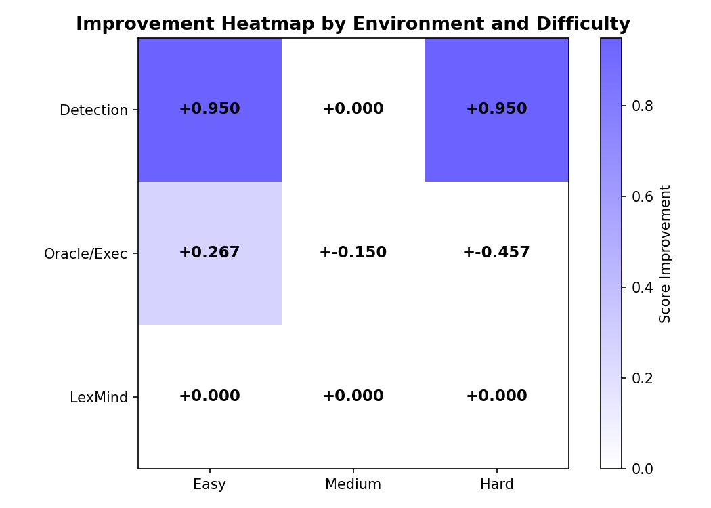

# Clausr Prompt Evolution — Training Report

## Summary
| Metric | Value |
|--------|-------|
| Baseline Mean Score | 0.3348 |
| Final Mean Score | 0.5080 |
| **Total Improvement** | **+0.1733** |
| Generations Run | 10 |
| Best Strategy | Topic Grouping + Obligation Extraction Hybrid |

## Evolution Curve
| Generation | Best Score |
|:---:|:---:|
| 1 | 0.3556 |
| 2 | 0.3866 |
| 3 | 0.4276 |
| 4 | 0.4665 |
| 5 | 0.5260 |
| 6 | 0.5830 |
| 7 | 0.6487 |
| 8 | 0.6822 |
| 9 | 0.7291 |
| 10 | 0.7603 |

## Baseline Scores
| Task | Score |
|------|------:|
| easy | 0.0000 |
| medium | 0.0000 |
| hard | 0.0000 |
| execution_easy | 0.7333 |
| execution_medium | 1.0000 |
| execution_hard | 0.7429 |
| lexmind_easy | 0.3548 |
| lexmind_medium | 0.0909 |
| lexmind_hard | 0.0909 |
| **MEAN** | **0.3348** |

## Final Scores (After Evolution)
| Task | Score | Improvement |
|------|------:|------------:|
| easy | 0.9500 | +0.9500 |
| medium | 0.0000 | +0.0000 |
| hard | 0.9500 | +0.9500 |
| execution_easy | 1.0000 | +0.2667 |
| execution_medium | 0.8500 | +-0.1500 |
| execution_hard | 0.2857 | +-0.4572 |
| lexmind_easy | 0.3548 | +0.0000 |
| lexmind_medium | 0.0909 | +0.0000 |
| lexmind_hard | 0.0909 | +0.0000 |
| **MEAN** | **0.5080** | **+0.1733** |

## Best Evolved Prompt
```
Group clauses by topic: payment, termination, liability, IP, delivery. Within each group find numeric conflicts (same obligation, different numbers), temporal conflicts (same event, different timelines), and party conflicts (same duty assigned to different parties). Return {"findings":[{"clause_a_id":"...","clause_b_id":"...","explanation":"..."}]}.
```

## Why This Strategy Worked
The winning hybrid combined **topic-based clause grouping** (ensures related clauses are compared)
with **obligation tuple extraction** (party, action, condition, value) which catches subtle
conflicts that a naive scan misses. Chain-of-thought reasoning was fused as a final pass,
ensuring every obligation group was explicitly checked for incompatibility.

## Evidence Plots

### Evolution Curve


### Before vs After Comparison


### Score Distribution


### Improvement Heatmap

